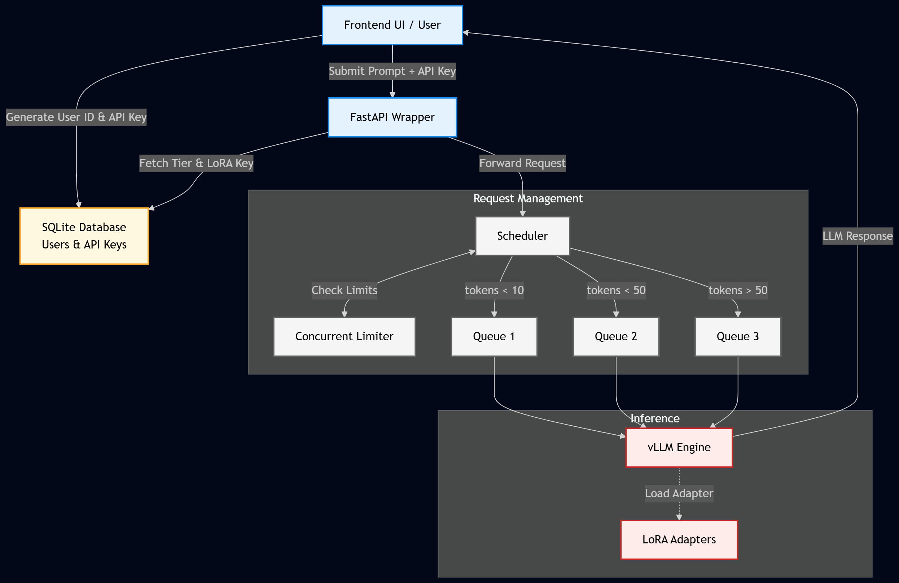

# Multi-Tenant LLM Inference Gateway

A high-performance, containerized API gateway for managing and serving Large Language Models (LLMs) to multiple tenants. Built to wrap around the **vLLM** engine, this gateway provides enterprise-grade features including request scheduling, concurrent user rate-limiting, API key management, and dynamic Multi-LoRA routing.

## 🚀 Features

* **High-Throughput Inference:** Leverages `vLLM` as the core engine for state-of-the-art serving throughput and memory management (PagedAttention).
* **Multi-Tenancy & Authentication:** Uses an embedded `SQLite` database to manage user accounts, securely store API keys, and track tenant-specific usage.
* **Concurrency Limiting:** Built-in rate limiter restricts the number of concurrent requests per user/tenant to prevent resource starvation and ensure fair usage.
* **Smart Request Scheduling:** Queues and schedules incoming inference requests to optimize GPU utilization and maintain stable latency under heavy load.
* **Dynamic Multi-LoRA Support:** Allows different tenants to seamlessly query different fine-tuned LoRA adapters on top of a single base model without needing to load multiple base models into VRAM.
* **Fully Containerized:** Easily deployable via Docker, ensuring environment consistency across different host machines.

## 🏗️ Architecture

    

🛠️ Technology Stack
Inference Engine: vLLM

API Framework: FastAPI / Python

Database: SQLite

Deployment: Docker

📦 Getting Started
Prerequisites
Docker installed on your host machine.

NVIDIA GPU(s) with drivers installed.

NVIDIA Container Toolkit installed to expose GPUs to Docker.

Running the Gateway
You can spin up the entire gateway using the following Docker command. This command mounts a local data directory to persist your SQLite database and model weights, exposes port 8000, and grants the container access to all available GPUs.

# 1. Clone the repository
git clone [https://github.com/Rohit2sali/vllm-multi-tenant-llm-gateway](https://github.com/Rohit2sali/vllm-multi-tenant-llm-gateway)
cd multi-tenant-llm-gatewa

# 2. Download the Loras
python download_loras.py

# 3. Run the container
sudo docker-compose up -d

